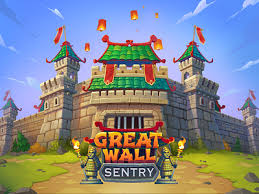
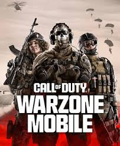
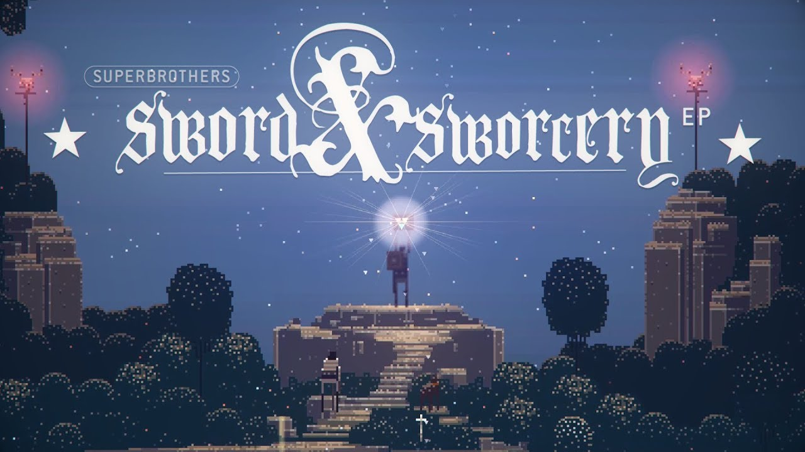
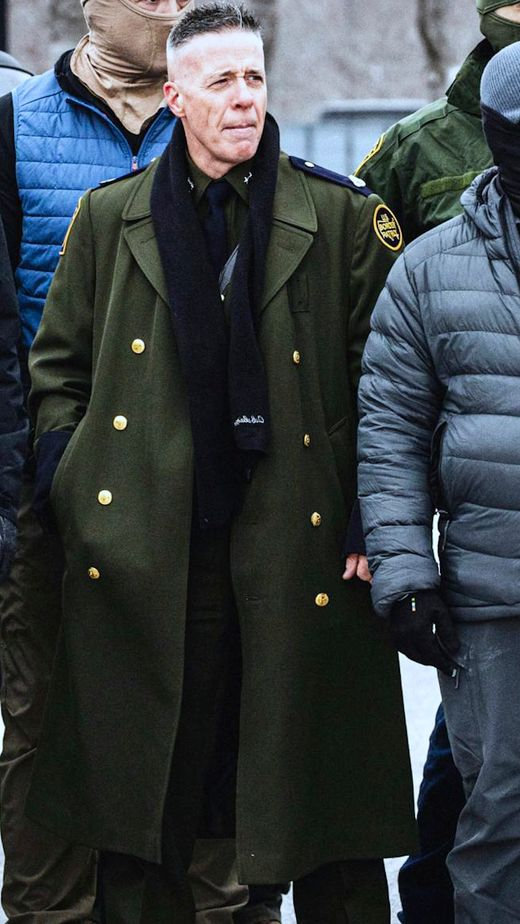
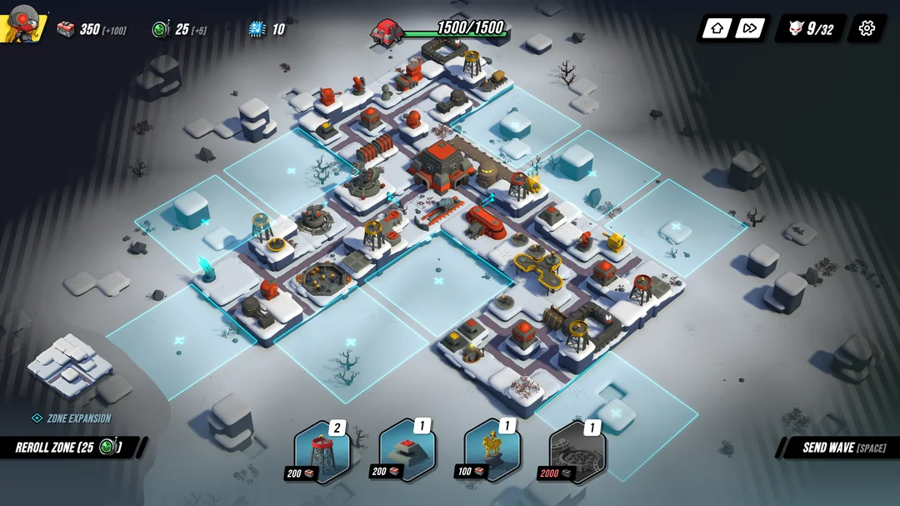

# Goligee -- Visual References & Inspiration

## Primary Inspiration

### Papers Please
- **Why**: The gold standard for bureaucratic dystopia aesthetic. Oppressive UI design
  with stamping, filing, and document-checking mechanics that feel institutional.
  Muted institutional color palette -- olive greens, document yellows, passport blues.
- **Take from it**: UI design language (rubber stamps, bureaucratic forms, approval/denial
  feedback), institutional color palette, the weight of state authority conveyed through
  mundane visual design

### Not Tonight
- **Why**: Bouncer/border control theme set in a post-Brexit dystopian Britain. Neon-lit
  urban grime, authoritarian propaganda posters plastered on every wall, rain-slicked streets.
- **Take from it**: Propaganda poster aesthetic, neon signage against dark urban backdrops,
  the visual language of a surveillance state dressed up as nightlife

### Beholder
- **Why**: Surveillance state apartment building rendered in dark silhouettes. Every resident
  is a shadow, every room is a cross-section of paranoia. The visual design makes the player
  feel like a voyeur and an enforcer simultaneously.
- **Take from it**: Dark silhouette character design, cross-section building layouts,
  paranoid atmosphere through limited visibility, the feeling of watching and being watched

### Orwell
- **Why**: Digital surveillance as gameplay. Data-heavy UI with terminal-green text,
  propaganda screens, and the cold sterility of a government monitoring system.
- **Take from it**: Terminal/CRT monitor aesthetic, data-stream UI elements, green-on-black
  text overlays, propaganda broadcast screens, digital surveillance HUD elements

### RIOT: Civil Unrest
- **Why**: The most direct visual reference -- an actual riot simulation game. Crowd dynamics
  rendered as pixel masses, tear gas clouds obscuring the field, police formations
  holding lines, molotov cocktails arcing through smoke.
- **Take from it**: Crowd rendering techniques, tear gas/smoke visual effects, police
  formation silhouettes, the visual chaos of civil unrest, protest sign variety

---

## Game Style References

### Pixel Art & Atmosphere
| Game | What to Reference |
|------|-------------------|
| **Dead Cells** | Fluid pixel animation, particle-heavy combat, explosion effects |
| **Hyper Light Drifter** | Atmospheric fog, screen shake, environmental storytelling through ruin |
| **Celeste** | Clean pixel art with atmospheric backgrounds, parallax fog layers |

### Tower Defense Visual References
| Game | What to Reference |
|------|-------------------|
| **Kingdom Rush** | Isometric layout, tower placement on fixed points, enemy pathing clarity |
| **Bloons TD 6** | Upgrade path visual progression -- each tier looks distinctly more powerful |

### Isometric References
| Game | What to Reference |
|------|-------------------|
| **Into the Breach** | Clean isometric grid, strategic clarity, readable unit designs at small scale |
| **Hades** | Atmospheric lighting in isometric view, particle systems, environmental mood |

### Dystopia & Urban Ruin
| Game | What to Reference |
|------|-------------------|
| **This War of Mine** | Wartime urban ruin, scavenging through bombed-out buildings, civilian desperation |
| **Frostpunk** | Authoritarian management aesthetic, harsh decisions presented through cold UI, societal collapse |

---

## Reference Images

| Image | What to Reference |
|-------|-------------------|
|  **Great Wall Sentry** | Colorful tower defense layout -- fixed tower placement on walls, clear enemy pathing, layered castle architecture. Contrast study: our version replaces the cheerful palette with concrete brutalism and riot barriers |
|  **Call of Duty: Warzone Mobile** | Military operator silhouettes, tactical gear loadout variety, gritty desaturated color grading. Reference for tower unit character design -- helmets, body armor, weapon stances |
|  **Superbrothers: Sword & Sworcery EP** | Atmospheric pixel art with modern post-processing. Blackletter title typography (similar to our Pirata One). Proof that pixel art + cinematic lighting + ambient particles = premium feel at low fidelity |
|  **Military officer greatcoat** | Olive drab double-breasted greatcoat with gold buttons, black scarf, authoritarian command presence. Character design reference for high-rank tower units or commander UI portrait |

---

## Visual Pillars

### 1. Urban Decay
- Cracked asphalt with weeds pushing through
- Rubble piles, collapsed walls, exposed rebar
- Chain-link fences topped with razor wire
- Graffiti tags and protest slogans on every surface
- Persistent smoke, smog, and haze hanging over the map
- Burned-out vehicles as environmental props
- Puddles reflecting harsh overhead lights

### 2. Institutional Oppression
- Harsh fluorescent lighting casting sharp shadows
- Black-and-yellow warning stripes on barricades and checkpoints
- Surveillance cameras mounted on poles and building corners
- Floodlights cutting through smoke
- Riot barriers, jersey walls, concertina wire
- Government building architecture -- brutalist concrete, narrow windows, heavy doors
- Propaganda banners and public address speakers

### 3. Spectacular Effects
- Tear gas clouds -- thick, billowing, partially obscuring units beneath
- Water cannon spray -- high-pressure arcs with mist falloff
- Flash-bang flares -- brief white-out with afterglow
- Rubber bullet tracers -- short bright streaks
- Molotov fire pools -- spreading orange glow on the ground
- Smoke grenade plumes -- colored smoke (red, yellow) for area denial
- Shield wall impacts -- sparks and shockwave rings on contact

### 4. 8-Bit Constraint Discipline
- Tile sizes: 32x16 isometric tiles (2:1 ratio)
- Sprite sizes: 16x16 base, 32x32 for large units, 48x48 for bosses
- Animation frames: 4-8 frames per animation (true 8-bit feel)
- No sub-pixel rendering or anti-aliasing on sprites
- Nearest-neighbor scaling only
- Post-processing effects (fog, smoke, light bloom) can be smooth/modern -- they are "the atmosphere"

### 5. Color Discipline
- Dominant palette: gunmetal grays, concrete tans, asphalt blacks
- Accent colors: warning amber (#FFBF00), emergency red (#CC0000), hazard orange (#FF6600)
- UI text: terminal green (#33FF33) on dark backgrounds for data/surveillance elements
- NO bright, saturated, or cheerful colors anywhere
- Each tower type distinguished by subtle equipment color coding, not bright palette shifts
- Night/overcast is the default atmosphere -- the world is perpetually under a gray-orange polluted sky
- Effects (tear gas, flash-bangs, fire) provide the only moments of brightness

---

### 6. Post-Soviet Brutalism
- **Panelka apartment blocks** -- mass-produced prefab concrete housing, uniform rectangular
  windows in grid patterns, stained and crumbling facade panels, exposed utility pipes
- Broken windows with jagged glass, some boarded up with plywood
- **Broken playgrounds** -- rusted swing sets with missing seats, collapsed climbing frames,
  cracked concrete sandbox borders, faded paint on metal equipment
- Exposed rebar where concrete has crumbled, water stains streaking down facades
- Satellite dishes bolted haphazardly to balconies
- Laundry lines between buildings (some with clothes, some snapped)
- Soviet-era mosaics partially destroyed on building facades
- Cramped courtyards between panelka blocks with cracked pavement
- Overhead electrical wires and cables strung chaotically
- Brutalist public infrastructure -- bus stops, underpasses, utility buildings
- Khrushchyovka-style 5-story blocks as background silhouettes

---

|  **Tower Defense Diorama (Zoom Reference)** | Zoomed-out isometric TD with compact miniature towers, visible grid on buildable zones, dark vignette around playfield, diorama/tabletop feel. Key takeaway: towers should be small relative to tiles, many more tiles visible at once |

---

## Mood Keywords
`urban` `concrete` `oppressive` `smoky` `authoritarian` `dystopian`
`institutional` `harsh` `propaganda` `surveillance` `post-soviet`
`panelka` `brutalist` `crumbling` `prefab`

## Anti-Mood (what we are NOT)
`bright` `cheerful` `cartoonish` `fantasy` `magical` `mystical` `twilight` `violet`
